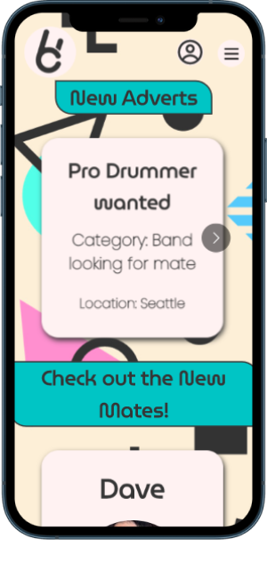
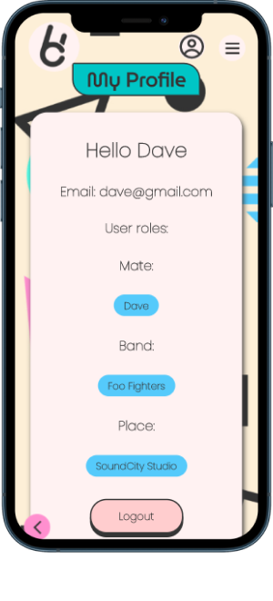
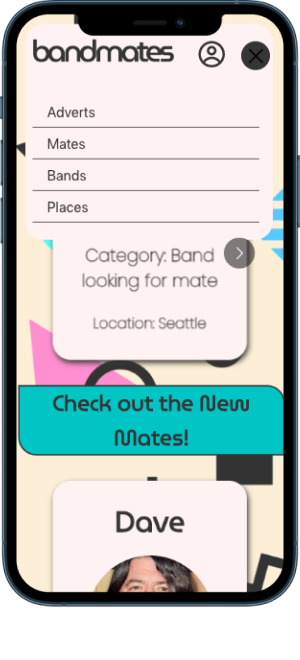
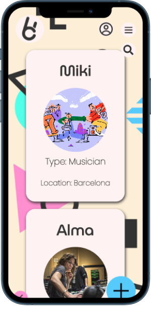
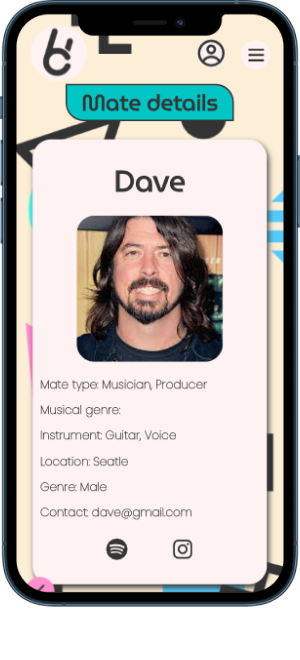
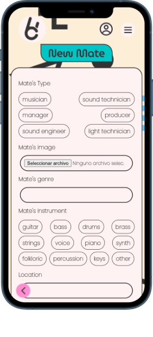
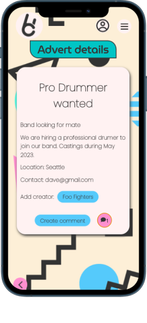

# BANDMATES
<em>Where finding your musical match is just a few taps away</em>

## Description

Bandmates is a platform designed for musicians and another musical tech profiles such as managers, producers and sound-technicians who are looking to connect with others in the music community. The platform allows users to create and post adverts to find potential bandmates, music partners, and places to play or record music.
---

## Instructions

When cloning the project, change the <code>sample.env</code> for an <code>.env</code> with the values you consider:
```js
REACT_APP_BACKEND_URL="http://localhost:8080"
```
Then, run:
```bash
npm install
```
To start the project run:
```bash
npm run start
```

For a proper view, use Google Inspection and add Iphone 12 Pro format (390x844px).

---

## Wireframes

Some wireframe examples:

Home logged



Profile



Navbar menu open



Mates




Mate Detail




New Mate form




Advert with comments




## User stories (MVP)

What can the user do with the app?
- User can sign up and create and account
- User can login
- User can log out
- User can create a Mate, Band and Place (Bandmates Roles)
- User can upload pictures
- User can create an Advert
- User can edit his Mates, Bands, Places and Adverts
- User can delete his Mates, Bands, Places and Adverts
- User can search into each field for mates, bands and Places by location or type
- User can see his own Bandmates roles in his profile view
- User can create comments inside adverts
- User can delete his comments

## User stories (Backlog)

- API Google Maps to locate the Bandmates
- Inbox messages (real time chat)
- App searcher with filters


---

## Useful links

- [Github Repo](https://github.com/mikibrut/frontend-template-m3)
- [Trello kanban](https://trello.com/b/IBzqquNL/bandmates)
- [Deployed version](https://bandmates.netlify.app/)
- [Presentation slides](https://docs.google.com/presentation/d/10lul18gnjLImY5lmKRytbhXvJNJPwgkH8tTjw0EKNaQ/edit#slide=id.p)


